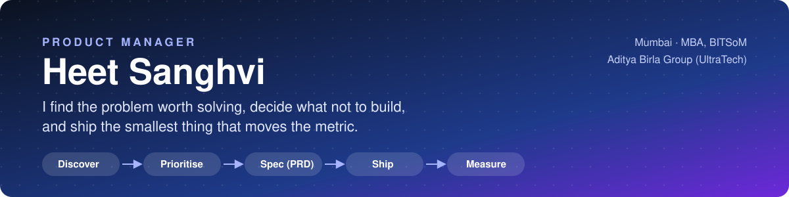

<table>
<tr>
<td width="170" valign="top"></td>
<td valign="top">

### Digital Product Manager at Birla Opus (Aditya Birla Group)

I own **Site Assist**, the survey and measurement app used by **1,500+ surveyors** for home painting services. Before this I was an **AI Product Manager at Aditya Birla Capital Digital**, where an agentic AI layer I introduced on the product landing page **lifted conversion by 22%**.

I came into product through the **Aditya Birla Group Leadership Program** (UltraTech, Hindalco, Birla Opus) after brand and growth roles at **Galderma**. **MBA, BITS School of Management.** Published author of *Leveraging AI in MBA*.

On GitHub you'll find products I take from idea to launch myself: each one has the **PRD**, the scope calls and the trade-offs, not just the code.

</td>
</tr>
</table>

## Product work at a glance

| **+22%** | **1,500+** | **26** | **3x to 40x** |
|:---:|:---:|:---:|:---:|
| conversion from an agentic AI layer on a product landing page | surveyors on the app I manage | products standardised on one AI-layer SOP | cheaper mapping API validated, at 97% pincode accuracy |

## What I do as a PM, with proof

| PM skill | Where I did it | Result |
|---|---|---|
| **AI products** | Built 5 agentic AI bots as an intelligence layer for early-funnel decisions at Aditya Birla Capital Digital | **+22%** conversion on the landing page |
| **Platform thinking** | Wrote the SOP to roll the AI layer out across 26 products | One playbook for mid-funnel decisions across the portfolio |
| **Experiments & validation** | Piloted an AI camera tool that measures wall area: 13 runs across 7 surfaces, checked against laser readings | A go / no-go based on accuracy data, not a demo |
| **Build vs buy, unit cost** | Evaluated a mapping API 3x to 40x cheaper than Google Maps on 200 real customer leads | **97%** pincode accuracy confirmed before switching |
| **Support & reliability** | Leading a root-cause program across 5 issue categories raised by 1,500+ surveyors | Fewer app support tickets (in progress) |
| **Release & adoption** | Built a 4-part training kit for every release: WhatsApp brief, one-pagers, user guide | Surveyors adopt each new version faster |
| **Internal product & adoption** | Rolled out an internal CRM at UltraTech; moved retailers onto SAP direct billing | **1,000+** retailers onboarded, **60%** of revenue |
| **User discovery** | Interviewed 8+ dermatologists, 30+ store owners and 20+ consumers for Cetaphil | Fed into Cetaphil's go-to-market plan |
| **Growth & metrics** | Revamped key features of Cetaphil India's website; set "Average Views" as a north-star metric for Vaseline (HUL) | **+28%** digital footfall |
| **0 → 1** | Founded Re.flecx (fashion) and co-founded Feed-A-Cow (NGO) | 40% gross margin; **₹35 lakh+** raised, 170+ volunteers |

## Product case studies

Each one follows the same path: **problem → insight → decision → trade-off → outcome.**

### 1. Site Assist at Birla Opus *(work product, summary only)*
- **Problem:** Surveyors measure walls by hand for painting quotes, and support tickets pile up after each app release.
- **What I'm doing:** Testing AI wall measurement against laser readings before rollout, cutting map costs with a cheaper API validated on real leads, running root-cause fixes on the top ticket categories, and shipping every release with a training kit.
- **PM lesson:** On a field app, adoption and accuracy matter more than features.

### 2. Mumbai Broker Map · [PRD](https://github.com/heetsanghvvii/mumbai-broker-map/blob/main/docs/PRD.md) · [repo](https://github.com/heetsanghvvii/mumbai-broker-map) · [live](https://mumbai-broker-map.vercel.app)
- **Problem:** Home buyers in Mumbai find brokers by word of mouth and can't tell who actually works near the building they want.
- **Insight:** People search by *place* (a building, an area, their office), not by broker name.
- **Decision:** Three entry points (building, area, commute) over one map of 1,500+ brokers in 52 areas, with one-tap Call, WhatsApp and a MahaRERA check.
- **Trade-off:** Cut house listings and broker onboarding from v1 to ship fast and stay neutral.
- **Business model:** Top 3 commute results free, full map ₹149 for 7 days, priced just above the ~₹132 Google cost of an uncached search. Hard spend caps fall back to a free map.

### 3. The Anand Medical College Murder · [PRD](https://github.com/heetsanghvvii/anand-medical-college-murder-mystery/blob/main/docs/PRD.md) · [repo](https://github.com/heetsanghvvii/anand-medical-college-murder-mystery)
- **Problem:** Paper murder-mystery kits break when the group size changes and are easy to spoil.
- **Decision:** A live web game that scales from 10 to 20 players without breaking the solution, with clues unlocked round by round.
- **Trade-off:** Kept the secrets (who did it, the codes) on the server only, which added build effort but makes cheating impossible.

### 4. One More Round *(private, pre-launch)*
A marketplace where hosts publish game nights and strangers request a seat. Written as a **business case, BRD and FRD before any code**, then built against that spec.

### 5. Sahayak *(private, in progress)*
A WhatsApp-first AI assistant for everyday admin in India (English, Hindi, Hinglish). Key product call: **the agent asks for approval before it pays, books or messages anyone**, because trust is the adoption blocker.

### 6. Vector AI · [repo](https://github.com/heetsanghvvii/vector-ai)
Turned open-ended AI services into **fixed-scope, fixed-price products** with separate India and international pricing, so buyers know what they get before they talk to anyone.

## How I work

1. **Fall in love with the problem.** Talk to users before writing a spec.
2. **Write it down.** One-page PRD: problem, user, success metric, what's out of scope.
3. **Cut scope hard.** Ship the smallest version that tests the riskiest assumption.
4. **Price and guardrail early.** Know the unit cost and the failure mode before launch.
5. **Measure, then decide.** Pilot, read the number, scale or kill.

I prototype my own products with AI coding tools (Claude Code), so I can test an idea with real users in days, and I speak the same language as engineers when we build.

## Experience

| Role | Company | When |
|---|---|---|
| **Digital Product Manager**, Site Assist | Birla Opus · Aditya Birla Group | 2026 to now |
| Leadership Associate (ABGLP): AI Product Manager · Sales Strategy · Consultant | Aditya Birla Capital Digital · Birla Opus · UltraTech | Jun 2025 to 2026 |
| Summer Intern (PPO), Strategy & Marketing | Hindalco · Aditya Birla Group | Apr to May 2024 |
| Graduate Trainee, Brand & E-commerce | Galderma India · Cetaphil, Biluma | 2022 to 2023 |
| Intern, Tax Onboarding | EY | Mar to May 2022 |
| Founder | Re.flecx | 2021 to 2022 |
| Co-Founder | Feed-A-Cow (NGO) | 2022 to now |

**Education:** MBA, BITS School of Management (2025) · B.Com, Mumbai University (2022, 8.67/10)
**Author:** *Leveraging AI in MBA* (Amazon), a practical guide to AI for business

---

Open to Product Manager roles. Message me on [LinkedIn](https://www.linkedin.com/in/heet-sanghvi-366331222/).
